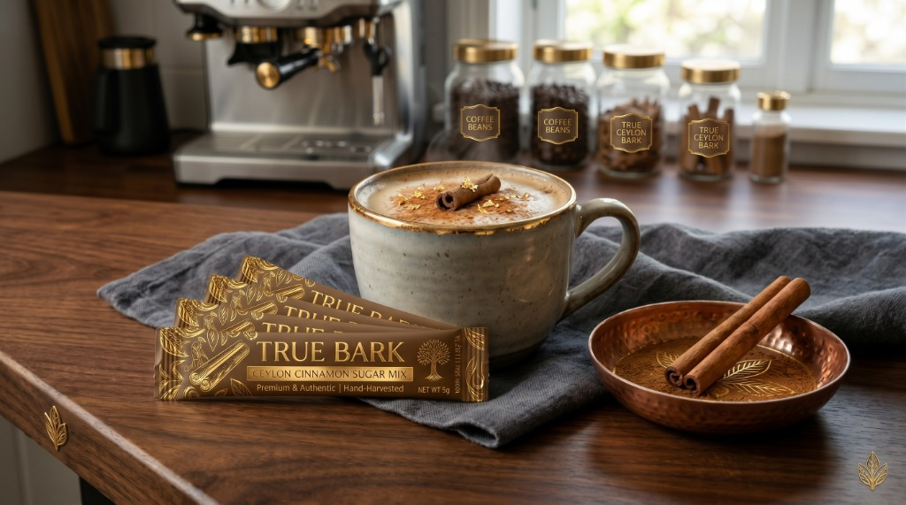

# True Bark — Authentic Hand-Harvested Ceylon Cinnamon

A luxury e-commerce storefront crafted for **True Bark**, an artisanal spice and specialty coffee companion brand specializing in authentic, pure Sri Lankan Ceylon Cinnamon (*Cinnamomum verum*).



---

## 🌟 The Product Line

1. **True Bark Ceylon Cinnamon Sugar Mix (5g Sticks)**
   - Single-serve golden packets designed to dissolve into espresso crema, lattes, cappuccinos, oatmeal, and toast.
   - Preserves volatile essential oils with an aroma-locked foil barrier.
2. **True Bark Ceylon Cinnamon Powder — Keepsake Metal Tins**
   - **Standard Gold & Dark Espresso Tin (140g)**: Collector's embossed metal tin celebrating Sri Lankan harvester heritage.
   - **Artisan Kraft Sample Brown Tin (140g)**: Lightweight pantry edition with rustic twine seal.
3. **Hand-Rolled Alba Grade Quills**
   - Slender cigar-rolled paper-thin inner bark sticks in an apothecary glass jar.
4. **The Barista & Connoisseur Tasting Set**
   - Deluxe collector's gift box including the Gold & Espresso tin, a 25-pack of Sugar Mix Sticks, a hand-hammered copper tasting dish, and an engraved brass measuring spoon.

---

## ☕ Why True Ceylon Cinnamon Matters

| Attribute | True Ceylon (*Cinnamomum verum*) | Common Cassia (*Cinnamomum cassia*) |
| :--- | :--- | :--- |
| **Coumarin Content** | **< 0.004% (Lab Certified Safe)** | Up to 1.00% (High liver toxicity risk) |
| **Flavor Profile** | Subtle, floral, naturally sweet, citrus notes | Harsh, pungent, bitter bite |
| **Structure** | Soft, paper-thin multi-layered rolls | Thick, woody, hollow bark |
| **Origin** | 100% Sri Lanka (Southern Estates) | Indonesia, China, Vietnam |

---

## ✨ Features

- **Responsive Luxury Design**: Built with responsive CSS Grid/Flexbox, custom color tokens, smooth micro-interactions, and Google Fonts (*Cormorant Garamond* & *Plus Jakarta Sans*).
- **Reactive Shopping Cart**: Full slide-over drawer with item increment/decrement, dynamic free shipping meter ($45 threshold), promo code discount calculator (`TRUEBARK15`, `FREESHIP`), and `localStorage` persistence.
- **Accessible Quick-View Modal**: Native `<dialog closedby="any">` implementation with click-bounds fallback, variant chip selectors, and **Subscribe & Save 15%** toggle.
- **Simulated Checkout Flow**: 3-step checkout simulation with shipping address autofill ("Fill Demo Info"), delivery options, test payment methods, and instant order confirmation receipt generation.
- **Multi-Currency Converter**: Real-time pricing updates across USD ($), EUR (€), GBP (£), and CAD ($).
- **Barista Pairing Recipes**: Signature coffee drinks with 1-click "Add to Cart" ingredients.

---

## 🚀 Local Development

No heavy build tools or dependencies required. Simply open `index.html` in any modern web browser or serve with any static HTTP server:

```bash
# Using Python
python -m http.server 8085

# Using Node / npx
npx serve .
```

---

## 📦 Deployment to Vercel

This repository is optimized for zero-config Vercel deployment:

```bash
# Deploy with Vercel CLI
npx vercel --prod
```

Or connect the GitHub repository directly to [Vercel](https://vercel.com) for automatic deployments on push.
